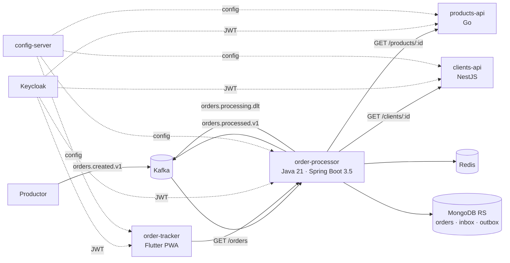

# Grupo Mariposa — Plataforma confiable de pedidos B2B

Distribuidores de MX, CO y PE publican pedidos en Kafka. `order-processor` los valida, los enriquece con los datos
de clientes y productos, calcula impuestos y descuentos, persiste el resultado en MongoDB y lo publica. Todo esto
con idempotencia, control de concurrencia y tolerancia a fallos parciales.



> **Sobre el monorepo**: en un escenario real cada componente (`order-processor`, `products-api`, `clients-api`,
> `order-tracker`, `config-server` y `contracts`) viviría en su **propio repositorio**, con su propio pipeline,
> versionado y ownership. Aquí están juntos para que la evaluación se haga con un solo clon y se levante con un solo
> comando. Los límites entre componentes se respetan igual: no comparten código, sólo contratos (`/contracts`).

## Contenido

| Carpeta | Qué es |
|---|---|
| `order-processor/` | Worker y núcleo de negocio (Java 21, Spring Boot 3.5, arquitectura hexagonal) |
| `products-api/` | Catálogo de productos (Go, `net/http` estándar) |
| `clients-api/` | Maestro de clientes (NestJS, TypeScript estricto) |
| `order-tracker/` | PWA Flutter para consultar pedidos, con Playwright en `e2e/` |
| `config-server/` + `config-repo/` | Configuración centralizada (Spring Cloud Config) |
| `contracts/` | Contratos: JSON Schema de eventos, OpenAPI de las APIs, error común RFC 9457 |
| `infra/` | Kafka, MongoDB, Keycloak, Prometheus, Grafana y Datadog |
| `deploy/helm/` | Chart reutilizable y values por servicio (EKS) |
| `e2e/karate/` | Suite de aceptación end-to-end |
| `load/` | Prueba de carga (ráfaga Kafka + k6) |
| `samples/events/` | 21 escenarios listos para publicar |
| `docs/` | Propuesta, ADRs, notas de implementación, liderazgo técnico, runbook y resultados de carga |

## Requisitos

- Docker Desktop 4.x o Docker Engine 24+ con Compose v2 (probado con Engine 29 y Compose v5), ~8 GB de RAM libres.
- Bash (Linux, macOS, WSL o Git Bash en Windows). En PowerShell se usa `.\mariposa.ps1`, que delega en bash.
- Sólo para ejecutar las pruebas fuera de Docker: JDK 21, Go 1.26, Node 24. Flutter no es necesario (corre en Docker).

## Ejecutar

```bash
./mariposa.sh up
```

Este comando:
1. Genera `.env` con **secretos aleatorios** si no existe. Nunca se commitea; ver `.env.example`.
2. Construye las imágenes y levanta 14 contenedores esperando sus healthchecks: 13 de larga duración y
   `kafka-init`, que crea los tópicos y termina (`datadog-agent` es un perfil opcional).
3. Imprime las URLs. La contraseña de los usuarios demo sólo se muestra con `./mariposa.sh urls --show-secrets`.

| URL | Qué hay |
|---|---|
| http://localhost:8090 | PWA order-tracker (usuarios `analyst`, `admin`, `viewer`) |
| http://localhost:8080/swagger-ui.html | Swagger de la API de pedidos |
| http://localhost:8082/docs | Swagger de clients-api |
| http://localhost:8180 | Keycloak |
| http://localhost:8085 | Kafka UI |
| http://localhost:3001 | Grafana (dashboard "Grupo Mariposa — Procesamiento de pedidos") |
| http://localhost:9090 | Prometheus (con reglas de alerta) |
| http://localhost:16686 | Jaeger (trazas) |
| http://localhost:8888 | Config server (requiere credenciales del `.env`) |

Todos los puertos se publican sólo en `127.0.0.1`. Los usuarios demo (`analyst`, `admin`, `viewer`) y el cliente
`orders-cli` (password grant, tokens de 15 minutos para herramientas) existen **sólo en el realm local**
(`infra/keycloak/realm-mariposa.json`); en staging y producción el realm no los incluye y los usuarios vienen del
proveedor de identidad corporativo.

Otros comandos: `./mariposa.sh down | clean | status | logs [svc] | urls [--show-secrets] | token [usuario]`.

## Publicar un evento de ejemplo

```bash
./mariposa.sh publish 01-approved-golden-mx.json   # el ejemplo del enunciado → grandTotal 2100.11
./mariposa.sh scenarios                            # publica los 21 escenarios de samples/events
```

Los escenarios cubren: aprobados por mercado, cliente exento, rechazos (cliente bloqueado, mercado distinto, producto
descontinuado o inexistente), inválidos (moneda, producto repetido, campos faltantes), fallos transitorios que se
recuperan, fallos técnicos definitivos, duplicado exacto, conflicto de versión, versión nueva y versión obsoleta.

## Verificar MongoDB y el evento de salida

```bash
./mariposa.sh mongo                                          # últimos 5 pedidos
./mariposa.sh mongo 'db.orders.findOne({_id: "ORD-MX-000147"})'
./mariposa.sh mongo 'db.outbox.find({orderId: "ORD-MX-000147"}).toArray()'
./mariposa.sh consume                                        # orders.processed.v1
./mariposa.sh consume orders.processing.dlt                  # DLT con headers
curl -H "Authorization: Bearer $(./mariposa.sh token)" localhost:8080/orders/ORD-MX-000147
```

## Pruebas

```bash
./mariposa.sh test   # las 4 suites de los componentes
./mariposa.sh e2e    # Karate + Playwright contra la plataforma levantada
```

| Componente | Comando | Qué incluye | Cobertura |
|---|---|---|---|
| order-processor | `./mvnw verify` | 316 unitarias, 20 de integración con Testcontainers (Kafka, Mongo RS, Redis, WireMock), ArchUnit, contratos, Checkstyle, SpotBugs | 100 % dominio y aplicación, 98,5 % global (gate) |
| products-api | `go test ./... -race` | unitarias, handler, contrato OpenAPI, apagado controlado | 100 % en paquetes de producción |
| clients-api | `npm run lint && npm run test:cov` | unitarias, e2e con Supertest, contrato con Ajv | 100 % líneas, ramas y funciones (gate) |
| order-tracker | `docker build --target test order-tracker` | bloc, widgets, responsive, PKCE, carreras de respuestas | 100 % líneas |
| config-server | `./mvnw verify` | arranque, seguridad, servicio de configuración | 100 % (gate) |
| Plataforma | `./mariposa.sh e2e` | 38 escenarios Karate (APIs, flujo, DLT, idempotencia, concurrencia, resiliencia) + 8 Playwright (escritorio y móvil) | — |
| Carga | `./load/event-burst.sh` y `load/k6/apis.js` | ver `docs/load-test-results.md` | — |

**Simulación de fallos**: `products-api` y `clients-api` aceptan reglas `FAULT_RULES=id:tipo[:veces]` (`429`, `500`,
`502`, `503`, `400`, `timeout`) desde el `config-repo`, sólo con `FAULT_INJECTION_ENABLED=true` (perfil `docker`).
En staging y producción está desactivada. Por defecto `PRD-012` falla 2 veces y se recupera, `PRD-013`
hace timeout, `PRD-014` responde 400, `CLI-40001` falla 2 veces y `CLI-40002` siempre responde 503.

## Configuración

Precedencia en todos los servicios: **variable de entorno > config server > valor por defecto**.

- Parámetros (timeouts, reintentos, circuit breaker, TTL de caché, relay, tasas de impuesto, descuento, reglas de
  fallo, rate limit): `config-repo/<servicio>.yml` y `config-repo/<servicio>-docker.yml`.
- Secretos: sólo por variables de entorno. En local vienen del `.env` generado; en CI de GitHub Secrets; en EKS de
  AWS Secrets Manager mediante External Secrets.

| Variable (`.env`) | Uso |
|---|---|
| `MONGO_ROOT_*`, `MONGO_APP_*` | usuario administrador y usuario de aplicación de MongoDB |
| `REDIS_PASSWORD` | Redis |
| `KEYCLOAK_ADMIN_*`, `KEYCLOAK_PUBLIC_URL` | administración y URL pública de Keycloak |
| `ORDER_PROCESSOR_CLIENT_SECRET` | client credentials de `order-processor` |
| `DEMO_USER_PASSWORD` | contraseña de `analyst`, `admin` y `viewer` |
| `PII_ENCRYPTION_KEY` | llave AES-256 (base64) para cifrar datos personales en MongoDB |
| `CONFIG_SERVER_USERNAME` / `CONFIG_SERVER_PASSWORD` | acceso al config server |
| `GRAFANA_ADMIN_*` | Grafana |
| `DATADOG_ENABLED`, `DD_API_KEY`, `DD_SITE` | opcional: `docker compose --profile datadog up` |

El detalle de cada variable por servicio está en el README de cada componente.

## Decisiones clave (resumen)

- **Idempotencia**: inbox con `_id = eventId` + upsert condicional por `eventVersion` + outbox, todo en **una
  transacción** de MongoDB. El `exists` previo es sólo un atajo; la garantía está en las restricciones. (ADR 0002)
- **Tres casos de concurrencia**: mismo `eventId` → un solo efecto; mismo `orderId`+versión con otro `eventId` →
  gana el primero y el segundo va a la DLT como `VERSION_CONFLICT`; versión menor después de una mayor → se ignora.
- **Offsets**: commit manual por registro, sólo después del commit en Mongo o de publicar en la DLT.
- **Concurrencia**: un listener por partición y fan-out HTTP en virtual threads, acotado por bulkhead. (ADR 0001)
- **Resiliencia**: timeout 2 s, 3 reintentos con backoff exponencial y jitter (respeta `Retry-After`), circuit
  breaker por dependencia y hasta 4 reintentos a nivel registro, sólo para errores transitorios.
- **Seguridad**: OAuth2/OIDC con Keycloak (client credentials entre servicios, PKCE en la PWA, roles por endpoint),
  nombre del cliente cifrado con AES-256-GCM, validación con listas blancas y contrato de error sin detalles internos.
- **Observabilidad**: logs JSON con `orderId`, `eventId` y `traceId`; métricas Micrometer/Prometheus; trazas OTLP a
  Jaeger; dashboard y alertas; Datadog como perfil opcional.

Documentos: [propuesta](docs/architecture-proposal.md) · [ADRs](docs/adr) ·
[notas de implementación](docs/implementation-notes.md) · [liderazgo técnico](docs/technical-leadership.md) ·
[convenciones](docs/platform-conventions.md) · [estándares](docs/engineering-standards.md) ·
[runbook](docs/runbooks/missing-order.md) · [carga](docs/load-test-results.md).

## Despliegue (preparado, no aplicado)

- `deploy/helm/mariposa-service`: un único chart reutilizable (Deployment con UID numérico por servicio, raíz de
  sólo lectura, startupProbe y `preStop`; Service, HPA, PDB, NetworkPolicy, ExternalSecret, Ingress ALB).
- `deploy/helm/values/<servicio>.yaml` tiene lo común (FQDN internos, tunables, llaves de secretos) y
  `deploy/helm/values/<ambiente>/<servicio>.yaml` los hosts de staging y producción. Los dominios `example.com`, la
  cuenta `ACCOUNT_ID` y el CIDR de la VPC son **placeholders** que se reemplazan al aprovisionar la cuenta.
- Los cinco servicios (incluido `config-server`, 2 réplicas con backend git sobre `config-repo/`) leen su
  configuración del config server con credenciales de External Secrets y el perfil del ambiente.
- `.github/workflows/ci.yml`: filtros por carpeta, lint, tests con umbrales de cobertura, `oasdiff` contra la rama
  base y `ajv` sobre esquemas y ejemplos, `helm lint` + `kubeconform`, imágenes con Trivy y E2E con Compose. Todas
  las actions están fijadas por SHA.
- `.github/workflows/deploy.yml` (sólo desde `main` o tags) y `Jenkinsfile`: servicios validados contra una lista
  permitida, escaneo Trivy antes del push a ECR y `helm upgrade --atomic` con el overlay del ambiente, usando un rol
  asumido (OIDC en GitHub, `sts assume-role` en Jenkins).
- Destino sugerido: EKS + MSK (TLS) + MongoDB Atlas + ElastiCache (TLS) + Secrets Manager. Detalle y próximos pasos
  en [implementation-notes](docs/implementation-notes.md#7-despliegue-en-eks).

## Limitaciones conocidas

- Kafka y MongoDB corren con un solo nodo en local: sirve para demostrar transacciones y particiones, no la
  tolerancia a fallos del cluster.
- Las APIs de productos y clientes usan datos semilla en memoria (permitido por el enunciado). Reemplazarlos es
  implementar un adaptador del puerto de repositorio.
- Sin Schema Registry: los contratos son JSON Schema versionados y validados en tests y CI.
- El reproceso de la DLT es manual (re-publicar el mensaje original, que es seguro por diseño).
- Con `CONFIG_SERVER_FAIL_FAST=true`, si el config server está caído no arrancan nuevas instancias.
- Más detalle en [implementation-notes](docs/implementation-notes.md).

## Uso de herramientas de inteligencia artificial

Tal como permite el enunciado, usé un asistente de IA (Claude, en Claude Code) como apoyo durante el desarrollo.

- **Para qué lo usé**:
  - Generar código a partir de las decisiones de arquitectura, los contratos y los estándares que definí antes de
    implementar.
  - Escribir pruebas y *scaffolding* de infraestructura (Compose, Helm, pipelines).
  - Revisiones de código independientes con quality gates.
  - Redactar documentación.
- **Qué verifiqué personalmente**:
  - Las reglas de negocio y el ejemplo dorado del enunciado (2100.11).
  - La estrategia de idempotencia y concurrencia, y la política de offsets.
  - Los contratos y la clasificación de errores reintentables y definitivos.
  - La configuración de seguridad: emisor de tokens, roles y ausencia de secretos en el repositorio.
  - La ejecución de las suites (unitarias, integración, Karate, Playwright y carga) contra la plataforma levantada.
- **Una sugerencia descartada**: verificar la duplicidad con `exists` antes de guardar y confiar en el orden por
  partición de Kafka. La descarté porque no resiste rebalanceos, replays desde la DLT ni varias instancias. La
  garantía quedó en restricciones atómicas de MongoDB (inbox con `_id = eventId` y upsert condicional por versión),
  y se prueba con 8 hilos procesando el mismo evento.
- **Otra sugerencia descartada**: usar gRPC entre servicios. El enunciado fija contratos HTTP/JSON y gRPC no
  resolvía ningún problema presente.
