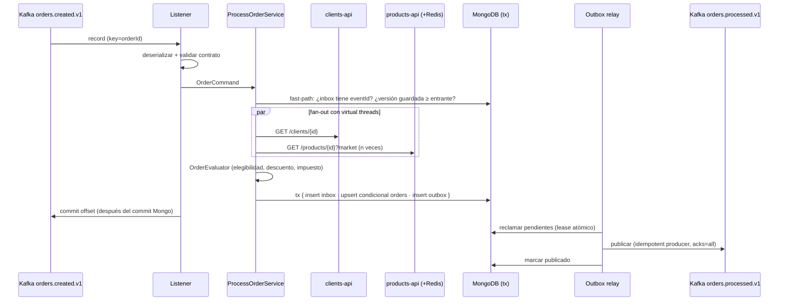
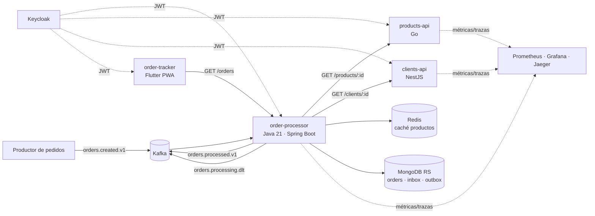

# Propuesta de arquitectura — Plataforma confiable de pedidos B2B

> Escrita **antes** de iniciar la implementación. Las diferencias con lo construido se registran en
> `docs/implementation-notes.md`. Las decisiones clave están en `docs/adr/`.

## 1. Entendimiento del problema

Distribuidores de MX, CO y PE envían pedidos que llegan como eventos a Kafka (`orders.created.v1`).
`order-processor` debe transformar cada evento en **exactamente un resultado de negocio**
(`APPROVED` o `REJECTED`) o en un `TECHNICAL_FAILURE` explícito y recuperable, persistirlo en MongoDB
y anunciarlo en `orders.processed.v1`.

Lo difícil no es el cálculo, sino:

- Kafka entrega **al menos una vez**: duplicados, reordenamientos y reintentos son normales.
- Dos dependencias HTTP (`clients-api`, `products-api`) pueden fallar de forma parcial o transitoria.
- Persistir y publicar son dos sistemas distintos: sin estrategia hay pedidos sin evento o eventos sin pedido.
- Varias instancias del worker compiten por los mismos pedidos durante un rebalanceo.

El éxito se mide por **invariantes verificables**, no por el happy path:

| # | Invariante | Cómo se garantiza |
|---|---|---|
| I1 | Un `eventId` produce como máximo un efecto de negocio | `_id` único en `inbox` dentro de la misma transacción |
| I2 | Un `(orderId, eventVersion)` tiene un único resultado | upsert condicional atómico sobre `orders._id = orderId` |
| I3 | Una versión menor nunca pisa una mayor | predicado `eventVersion < incoming` en la misma operación atómica |
| I4 | No hay pedido persistido sin evento de salida | Transactional Outbox en la misma transacción Mongo |
| I5 | No hay evento de salida sin pedido persistido | el evento sólo nace del outbox, después del commit |
| I6 | Un mensaje inválido nunca se persiste como pedido | la validación ocurre antes de cualquier escritura; va a la DLT |
| I7 | Los importes son deterministas | `BigDecimal`, escala 2, `HALF_UP` por importe, totales = suma de redondeados |

## 2. Supuestos

1. `eventVersion` es la **revisión del pedido** (v2 corrige v1); la versión del **esquema** vive en el nombre del tópico (`.v1`).
2. Si `eventVersion` no viene, se asume `1`. `occurredAt` y `channel` son opcionales (el PDF no los lista como obligatorios).
3. Campos desconocidos se **ignoran** (tolerant reader) para permitir evolución aditiva del productor.
4. Moneda que no corresponde al mercado = **error de validación** (contrato roto), no rechazo de negocio.
5. `404` de clientes o productos = **rechazo de negocio** (`CLIENT_NOT_FOUND` / `PRODUCT_NOT_FOUND`), no fallo técnico.
6. Un producto existe **por mercado**: `PRD-001` puede existir en MX y no en PE (`404` para esa combinación).
7. Si hay varios motivos de rechazo se reportan **todos** en `violations`; `reason` es el código principal (el primero según el orden de evaluación).
8. `TECHNICAL_FAILURE` es un estado **no terminal**: el mismo evento reprocesado (replay desde la DLT) o una versión mayor pueden resolverlo.
9. El nombre del cliente es dato personal: se persiste cifrado y nunca se loguea.
10. Autenticación no es requisito del PDF; se agrega con Keycloak (OAuth2/OIDC) porque es lo esperable en producción, sin afectar las reglas de negocio.

## 3. Responsabilidades y límites

| Componente | Responsabilidad | Dueño de | No hace |
|---|---|---|---|
| `order-processor` (Java 21 / Spring Boot 3.5) | Validar, enriquecer, calcular, decidir, persistir, publicar. Expone `GET /orders/{id}` y `GET /orders` | colecciones `orders`, `inbox`, `outbox`; contratos `orders.processed.v1`, `orders.processing.dlt`, OpenAPI de Orders | No es dueño de datos de clientes ni productos: guarda un *snapshot* de lo que usó para decidir |
| `products-api` (Go 1.22+, stdlib) | Catálogo de productos por mercado | contrato OpenAPI de Products | No conoce pedidos ni impuestos por mercado (sólo `taxCategory`) |
| `clients-api` (NestJS / TS estricto) | Maestro de clientes | contrato OpenAPI de Clients | No conoce pedidos ni descuentos (sólo `segment` y `taxRegime`) |
| `order-tracker` (Flutter web, PWA) | Consultar pedidos y su resultado | ninguno (consumidor) | No calcula nada; sólo presenta el contrato de Orders |
| Productor de pedidos (externo) | Publica `orders.created.v1` | contrato `orders.created.v1` | — |

**Dependencias permitidas**: `order-processor → clients-api`, `order-processor → products-api` (HTTP síncrono),
`order-processor ↔ Kafka`, `order-processor → MongoDB`, `order-processor → Redis` (caché opcional),
`order-tracker → order-processor`. Todo lo demás está prohibido; en particular, las APIs no se llaman entre sí
y nadie lee las colecciones de `order-processor` salvo él mismo.

**Qué no se filtra a los consumidores**: `products-api` no expone costos, proveedor ni stock; `clients-api`
no expone datos de contacto ni información fiscal más allá de `taxRegime`. `orders.processed.v1` no
lleva el nombre del cliente (PII) ni el detalle interno de errores técnicos.

## 4. Capas, puertos y adaptadores (`order-processor`)

```
com.grupomariposa.orders
├── domain                      ← Java puro, sin Spring/Kafka/Mongo/HTTP
│   ├── model                   Order, OrderLine, Money, Market, Currency, TaxCategory, ClientProfile,
│   │                           ProductProfile, OrderStatus, Totals, Violation, RejectionCode
│   ├── policy                  EligibilityPolicy, TaxPolicy, DiscountPolicy, LinePricer
│   └── service                 OrderEvaluator (decide APPROVED / REJECTED y calcula importes)
├── application                 ← casos de uso; depende sólo de domain y de sus propios puertos
│   ├── port.in                 ProcessOrderUseCase, FindOrderQuery, ListOrdersQuery
│   ├── port.out                ClientDirectory, ProductCatalog, OrderStore, Clock/IdGenerator
│   ├── command                 OrderCommand (entrada ya validada, independiente de Kafka)
│   ├── validation              OrderCommandValidator (reglas de contrato mínimas del PDF)
│   └── service                 ProcessOrderService, OrderQueryService
└── infrastructure              ← adaptadores; único lugar con frameworks
    ├── kafka                   listener, DTO de entrada, mapper, error handler, DLT publisher, outbox relay
    ├── http                    RestClient + Resilience4j, DTOs externos, mapeo de errores HTTP
    ├── persistence             documentos Mongo, mappers, transacción inbox+orders+outbox, índices
    ├── cache                   decorador Redis de ProductCatalog (TTL explícito)
    ├── web                     controllers REST, DTOs de respuesta, ProblemDetail, seguridad
    ├── crypto                  cifrado AES-GCM de PII
    └── config                  propiedades tipadas, beans, observabilidad
```

- Cada capa tiene su modelo: `OrderCreatedMessage` (Kafka) → `OrderCommand` (aplicación) → `Order` (dominio)
  → `OrderDocument` (Mongo) → `OrderResponse` (REST) / `OrderProcessedMessage` (Kafka). Mapeos explícitos, sin reflexión.
- Patrones con un problema concreto detrás: **Strategy** (política de impuesto por mercado), **Decorator**
  (caché del catálogo), **Ports & Adapters** (sustituir fuentes de datos), **Transactional Outbox + Inbox** (consistencia).
- `products-api` y `clients-api` repiten la misma forma en pequeño: transporte → servicio → repositorio (puerto)
  con adaptador en memoria. Reemplazar la memoria por una BD es implementar un repositorio nuevo.

## 5. Flujo principal y flujos de error



| Situación | Clasificación | Reintento | Estado del pedido | Destino |
|---|---|---|---|---|
| JSON ilegible / esquema roto | `DESERIALIZATION` | nunca | no se persiste | DLT |
| Regla de contrato violada | `VALIDATION` | nunca | no se persiste | DLT |
| Cliente/producto `404` | rechazo de negocio | nunca | `REJECTED` + motivo | `orders.processed.v1` |
| Cliente `BLOCKED`, mercado distinto, producto `DISCONTINUED` | rechazo de negocio | nunca | `REJECTED` + motivo | `orders.processed.v1` |
| `429`, `500`, `502`, `503`, timeout, conexión rechazada | `EXTERNAL_TRANSIENT` | sí | `TECHNICAL_FAILURE` si se agota | DLT |
| `400`, `401`, `403`, otros `4xx`, cuerpo inválido | `EXTERNAL_PERMANENT` | nunca | `TECHNICAL_FAILURE` | DLT |
| Circuit breaker abierto | `EXTERNAL_TRANSIENT` | sí (nivel registro) | `TECHNICAL_FAILURE` si se agota | DLT |
| Mongo caído / timeout | `PERSISTENCE` | sí (nivel registro) | intenta registrar `TECHNICAL_FAILURE` | DLT |
| Error publicando al outbox relay | `PUBLICATION` | infinito con backoff | pedido ya persistido | alerta por lag del outbox |
| Mismo `eventId` | duplicado | — | sin cambios | ack + métrica |
| Mismo `orderId+eventVersion`, distinto `eventId` | `VERSION_CONFLICT` | nunca | sin cambios (gana el primero) | DLT (auditoría) |
| `eventVersion` menor a la guardada | obsoleto | — | sin cambios | ack + métrica |

**Presupuesto de reintentos** (dos niveles, no multiplicativos sin control):

- Nivel llamada (Resilience4j): timeout de conexión 500 ms, timeout de respuesta 2 s, **3 intentos**, backoff
  exponencial 200 ms × 2 con **jitter** 50 %, respetando `Retry-After` hasta 2 s. Circuit breaker por
  dependencia (ventana 20 llamadas, 50 % de fallos, 10 s abierto) y bulkhead de 32 llamadas concurrentes.
- Nivel registro (Spring Kafka `DefaultErrorHandler`): sólo para `EXTERNAL_TRANSIENT` y `PERSISTENCE`,
  backoff 1 s → 2 s → 4 s, **máximo 4 intentos de registro**. Al agotarse, el *recoverer* persiste
  `TECHNICAL_FAILURE` (si Mongo responde) y publica a `orders.processing.dlt`.
- Peor caso por registro ≈ 4 × (3 × 2 s + backoff) ≈ 35 s; con `max.poll.records=10` queda muy por debajo de
  `max.poll.interval.ms=300000`.

**Interrupción del proceso**: nada se escribe antes de la transacción final, así que una caída a mitad de las
llamadas HTTP o con una respuesta parcial no deja estado. El offset sólo se confirma después del commit en
Mongo, así que el mensaje se re-entrega y el inbox lo convierte en no-op si la transacción ya había confirmado.

**Metadata en la DLT** (el valor es el mensaje **original byte a byte**; la metadata va en headers):
`x-error-category`, `x-error-cause` (resumida, sin PII ni secretos, máx. 256 caracteres), `x-attempts`,
`x-failed-at`, `x-component=order-processor`, `x-order-id`, `x-event-id` (si pudieron extraerse),
más los headers estándar de Spring (`kafka_dlt-original-topic/partition/offset`).

## 6. Idempotencia y concurrencia

Modelo: **un listener por partición** (concurrencia = particiones asignadas), procesamiento **registro a registro**
y confirmación manual del offset. Dentro de un registro, las llamadas a clientes y productos van en paralelo
sobre **virtual threads**. La key `orderId` garantiza que las versiones de un mismo pedido lleguen ordenadas a la
misma partición; aun así, la corrección **no depende** del orden ni de que haya una sola instancia (rebalanceos,
productores que no respetan la key, replays desde la DLT). Detalle en `docs/adr/0001`.

La garantía está en MongoDB, no en la aplicación:

1. `inbox` con `_id = eventId`. Insertar dentro de la transacción: si ya existe → `DuplicateKey` → **caso 1**.
2. `orders` con `_id = orderId` y upsert condicional atómico:
   `filter = {_id, $or: [{eventVersion < v}, {eventVersion == v, sourceEventId == eventId, status == TECHNICAL_FAILURE}]}`.
   Si el documento existe y no cumple el filtro, el upsert intenta insertar el mismo `_id` → `DuplicateKey`.
   Se lee el documento vigente sólo para **clasificar**: misma versión con otro `eventId` → **caso 2**
   (`VERSION_CONFLICT`, gana el primero), versión mayor ya guardada → **caso 3** (obsoleto, se ignora).
3. `outbox` recibe el evento de salida en la **misma transacción**.
4. La verificación previa (`exists`) es sólo un *fast-path* para ahorrar llamadas HTTP; la garantía la dan
   los pasos 1–3. Los conflictos transitorios de escritura (`TransientTransactionError`) se reintentan.

**Política de offsets**: `enable.auto.commit=false`, `AckMode.RECORD`, commit sólo después del commit en Mongo
o después de publicar en la DLT. `isolation.level=read_committed`.

## 7. Consistencia entre MongoDB y Kafka

**Transactional Outbox** (ADR 0002). La transacción Mongo escribe `orders` + `inbox` + `outbox`. Un relay
(`@Scheduled` cada 250 ms, lotes de 100) reclama documentos `PENDING` con un *lease* atómico
(`findOneAndUpdate` a `IN_FLIGHT` con `leaseUntil`), publica con productor idempotente (`acks=all`) y marca
`PUBLISHED`. Si la instancia muere con el lease tomado, al vencer lo retoma otra. Resultado: entrega
**al menos una vez** de `orders.processed.v1` con `eventId` estable (generado una vez y guardado en el outbox),
así que los consumidores deduplican por `eventId`. MongoDB corre como **replica set** (requisito de transacciones).

## 8. Compatibilidad y evolución de contratos

- **Dueños**: `orders.created.v1` → equipo productor de pedidos; `orders.processed.v1` y `orders.processing.dlt`
  → equipo de `order-processor`; OpenAPI de Products → equipo de `products-api`; OpenAPI de Clients → equipo de
  `clients-api`. Los contratos viven en `/contracts` (JSON Schema + OpenAPI 3.1) con CODEOWNERS por archivo.
- **Cambios compatibles** (agregar campo opcional o nuevo valor de enum documentado como abierto): misma versión.
  Los consumidores son *tolerant readers*.
- **Cambios incompatibles** (renombrar, quitar, cambiar tipo o semántica): nuevo tópico `orders.created.v2`
  o nueva ruta `/v2/...`, publicación dual durante la migración (*expand → migrate → contract*) y fecha de
  retiro acordada.
- **CI**: los servicios validan sus respuestas y eventos reales contra el esquema de `/contracts` en sus tests;
  `oasdiff` y una comparación de JSON Schema bloquean PRs con cambios incompatibles no versionados.
- **Coordinación entre equipos**: el cambio se propone como PR sobre `/contracts` (revisan ambos dueños) antes de
  tocar código; el proveedor publica primero en modo aditivo; el consumidor migra; recién entonces se retira lo viejo.

## 9. Riesgos y posibles regresiones

| Riesgo | Impacto | Mitigación |
|---|---|---|
| Transacciones Mongo exigen replica set | no arranca local | replica set de un nodo con init automático en Compose |
| Relay de outbox atrasado | clientes ven el pedido sin evento | métrica `outbox.pending` + alerta de antigüedad |
| Tormenta de reintentos contra una API caída | cascada | circuit breaker + jitter + bulkhead |
| Caché de productos con estado viejo | aprobar un producto recién descontinuado | TTL de 5 min documentado; no se cachea el estado de clientes |
| Emisor de tokens con otra URL en Docker vs navegador | `401` en todas las llamadas | `KC_HOSTNAME` fijo + JWKS por red interna |
| Cambio de reglas de impuestos | importes distintos para el mismo pedido | reglas en el dominio con tests por mercado; el snapshot guardado conserva la tasa aplicada |
| Hot partition por un distribuidor grande | latencia | key `orderId` (no `clientId`) distribuye la carga |

## 10. Estrategia de pruebas

| Nivel | Qué prueba | Herramienta |
|---|---|---|
| Unitarias de dominio | impuestos por mercado/categoría, exención, descuento mayorista, redondeo, totales, elegibilidad, validaciones y bordes | JUnit 5 + AssertJ, parametrizadas |
| Unitarias de aplicación | orquestación, clasificación de errores, duplicados/obsoletos/conflictos | JUnit 5 + Mockito |
| Integración | Kafka + Mongo reales, WireMock simulando `429/5xx/timeout/404`, concurrencia real (N hilos con el mismo evento), outbox, DLT | Testcontainers |
| Contrato | eventos y respuestas validados contra `/contracts` | networknt JSON Schema, kin-openapi, Ajv |
| Go | servicio, repositorio, handler, middleware, apagado controlado | `testing` + `httptest`, table-driven |
| NestJS | servicio, repositorio, filtro de errores, endpoint | Jest + Supertest |
| Flutter | estados loading/empty/success/error, respuestas tardías | `flutter_test`, `bloc_test` |
| E2E | flujo completo levantado con Compose | Karate (API/Kafka) + Playwright (PWA) |
| Carga | throughput y latencia del procesamiento | k6 + script productor |

Cobertura exigida por el build: **100 % de líneas en dominio y aplicación**, ≥ 90 % global por servicio.

## 11. Decisiones descartadas

| Alternativa | Por qué se descartó |
|---|---|
| Kafka transactions (consume-transform-produce) | no incluye a MongoDB; seguiría habiendo doble escritura |
| Publicar a Kafka después del commit sin outbox | una caída entre ambos pierde el evento (viola I4) |
| Change Streams como relay | acopla el relay a la retención del oplog y complica el reintento; el poller es más simple de razonar y probar |
| Lock distribuido (Redis) por `orderId` | no sobrevive a pausas de GC ni particiones de red; la restricción en BD es la fuente de verdad |
| WebFlux reactivo | el cuello está en I/O acotado por partición; virtual threads dan el mismo beneficio con código imperativo más legible |
| gRPC entre servicios | el PDF fija contratos HTTP/JSON; gRPC no resuelve un problema presente |
| Gin/Echo en Go | el enrutador de Go 1.22 ya soporta métodos y parámetros de ruta; menos dependencias |
| Schema Registry | útil con Avro/Protobuf y muchos equipos; con JSON Schema versionado en el repo y validación en CI alcanza para esta etapa |

## 12. Plan de implementación incremental

1. Contratos en `/contracts` + esqueleto de infraestructura (Compose con Kafka, Mongo RS, Redis, Keycloak).
2. `products-api` y `clients-api` con datos semilla, errores homogéneos, health y fault injection.
3. Dominio de `order-processor` con tests (sin infraestructura).
4. Casos de uso + puertos; adaptadores HTTP con resiliencia.
5. Persistencia transaccional (inbox + orders + outbox) y listener Kafka con DLT.
6. Relay de outbox, observabilidad (Micrometer, OTel, logs JSON), seguridad.
7. Tests de integración con Testcontainers (duplicados, concurrencia, fallos).
8. API de consulta + `order-tracker` Flutter PWA.
9. E2E (Karate + Playwright), carga (k6), Helm, Jenkinsfile, GitHub Actions.
10. Documentación de cierre: implementation notes, liderazgo técnico, README.

## Plataforma completa



**Estándar compartido** (decisión transversal): formato de error (RFC 9457 `application/problem+json` con
`code` y `traceId`), propagación W3C `traceparent`, logs JSON con `orderId`/`eventId`/`traceId`, healthchecks
`/health/live` y `/health/ready`, nombres de métricas, versionado de contratos, autenticación JWT por Keycloak.
**A criterio de cada equipo**: framework web, estructura interna, librerías de test, estrategia de caché local.
Para no replicar abstracciones se comparte **el contrato**, no una librería común entre lenguajes.
