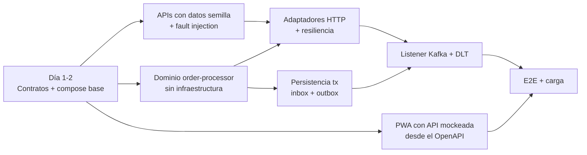

# Conducción técnica con un equipo de cuatro personas

Plan concreto para construir la primera versión productiva en paralelo sin perder coherencia.
Supuesto: 4 personas con perfiles mixtos, iteraciones de una semana, primera versión productiva en 4 semanas.

## 1. División inicial del trabajo y ownership

La responsabilidad de extremo a extremo no se fragmenta: cada persona es dueña de un componente **y** de una
capacidad transversal. Así nadie queda como "el de infraestructura" sin contexto de negocio.

| Persona | Componente dueño | Capacidad transversal | Revisa a |
|---|---|---|---|
| A (Tech Lead, Java senior) | `order-processor` dominio + aplicación | contratos y ADRs, consistencia/idempotencia | B, C |
| B (Java / plataforma) | `order-processor` adaptadores (Kafka, Mongo, outbox, DLT) | observabilidad, runbooks, on-call | A, D |
| C (Go + NestJS) | `products-api` y `clients-api` | contrato de errores, seguridad (Keycloak, rate limit) | A, D |
| D (Flutter + QA automation) | `order-tracker` PWA | E2E (Karate/Playwright), pruebas de carga, CI | B, C |

Cada servicio tiene un dueño primario y un segundo revisor (bus factor ≥ 2). Los contratos tienen CODEOWNERS
distintos para productor y consumidor.

## 2. Dependencias y orden de integración

Nadie espera a nadie: con los contratos acordados el día 1, las APIs se pueden simular con WireMock desde el
OpenAPI, la PWA consume un mock del OpenAPI de Orders y el dominio no necesita infraestructura.
Orden de integración real: APIs → adaptadores HTTP → persistencia → listener → relay → PWA contra backend real.

## 3. Contratos que acordaría antes de programar

1. `orders.created.v1` (entrada) y `orders.processed.v1` (salida), con su semántica de `eventVersion`.
2. Headers y categorías de `orders.processing.dlt`.
3. OpenAPI de Products, Clients y Orders, y el contrato de error RFC 9457 compartido.
4. Catálogo de códigos de rechazo y de categorías de error (son parte del contrato, no detalle interno).
5. Convenciones transversales: correlación (`traceparent`), formato de logs, nombres de métricas, healthchecks.
6. Datos semilla y reglas de fault injection para que todos prueben los mismos escenarios.

Todo vive en `/contracts` y se cambia sólo por PR con aprobación de productor y consumidor.

## 4. Branches, pull requests y code review

- Trunk-based con ramas cortas: `feature/<ticket>-<tema>` desde `develop`, vida máxima de 2 días. `main` = productivo
  y sólo recibe merges desde `develop` o `hotfix/*` con tag semántico.
- PR pequeño (idealmente < 400 líneas), con la plantilla del repo (contratos, blast radius, evidencia, rollback).
- **1 aprobación** obligatoria del dueño del componente; **2** si toca `/contracts`, persistencia o seguridad.
- El review se hace sobre riesgo: primero corrección (concurrencia, idempotencia, errores), después diseño y al final
  estilo. El estilo lo hacen cumplir los linters, no las personas.
- Commits convencionales para que el changelog y el versionado salgan solos.

## 5. Controles mínimos de CI

Bloqueantes en cada PR (ver `.github/workflows/ci.yml`):

1. Build + lint de cada componente afectado (path filters).
2. Tests unitarios con **umbral de cobertura** (100 % dominio/aplicación, ≥ 90 % global).
3. Tests de integración con Testcontainers en `order-processor`.
4. **Contratos**: `oasdiff breaking` sobre los OpenAPI y validación de los JSON Schema; cada servicio valida sus
   respuestas/eventos reales contra `/contracts` en sus propios tests.
5. Build de imágenes + escaneo Trivy (CRITICAL/HIGH bloquean).
6. E2E con Karate sobre el compose completo en `develop` y en PRs hacia `main`.
7. Sin secretos en el repo (secret scanning de GitHub + push protection).

## 6. Criterios para aprobar o rechazar una decisión técnica

Una propuesta se aprueba si responde con evidencia a estas preguntas (formato ADR corto):

1. ¿Qué problema **concreto y medido** resuelve? ("podría pasar" no basta).
2. ¿Qué alternativas se descartaron y por qué?
3. ¿Es reversible? Las decisiones de una sola vía (esquemas, contratos, datos) exigen más evidencia.
4. ¿Cuál es el costo operativo (on-call, upgrades, curva de aprendizaje) para un equipo de cuatro?
5. ¿Cómo se observa y cómo se revierte si sale mal?

Es **decisión local** (la toma el dueño del componente) si no cambia contratos, datos compartidos ni operación.
Es **decisión transversal** (ADR + revisión del Tech Lead) si afecta contratos, seguridad, observabilidad,
modelo de consistencia o agrega infraestructura.

## 7. Entrega incremental y rollback

| Incremento | Contenido | Cómo se libera | Rollback |
|---|---|---|---|
| 1 | APIs + contratos | deploy normal, sin consumidores | redeploy de la versión anterior |
| 2 | `order-processor` en **shadow mode**: consume, calcula y persiste, pero el relay no publica | flag `outbox.publish.enabled=false` | apagar el consumer group |
| 3 | Publicación habilitada para un mercado (MX) | flag por mercado | desactivar el mercado; el outbox retiene lo pendiente |
| 4 | CO y PE | flag por mercado | igual que el anterior |
| 5 | PWA de consulta | ingress nuevo | quitar el ingress |

Rollback de aplicación: `helm rollback` (despliegues `--atomic`). Rollback de datos: los cambios de esquema son
aditivos (expand/contract), así que la versión anterior sigue leyendo los documentos. Los eventos ya publicados no
se "despublican": se corrigen con una versión mayor del pedido.

## 8. Principales riesgos técnicos y responsables

| Riesgo | Responsable | Mitigación |
|---|---|---|
| Doble efecto por duplicados/rebalanceos | A | inbox + upsert condicional + test de concurrencia real |
| Pedido sin evento de salida | B | outbox + alerta por antigüedad del pendiente más viejo |
| Cascada por una API caída | C | timeouts, retry con jitter, circuit breaker, bulkhead |
| Cambio incompatible de contrato | A + C | CODEOWNERS dobles + oasdiff en CI |
| Datos personales filtrados en logs o eventos | C | cifrado en reposo, redacción de logs, revisión en PR |
| Latencia de procesamiento creciente | B | métricas p95/p99 + prueba de carga en CI nocturno |
| PWA mostrando respuestas viejas | D | cancelación de búsquedas (`restartable`) + tests de carrera |

## 9. Desacuerdo técnico entre dos integrantes

1. Cada uno escribe su postura en una página: problema, propuesta, riesgos, cómo se mediría el éxito.
2. Se busca un **experimento barato** que decida (spike de medio día, benchmark, prueba de carga).
3. Si los datos no deciden, decide el **dueño del componente**. Si es transversal, decide el Tech Lead.
4. La decisión queda en un ADR con la alternativa descartada y la condición para revisarla, así nadie "pierde":
   queda registrado cuándo se volvería a abrir la discusión.
5. Disagree and commit: una vez decidido, ambos lo implementan y lo defienden.

## 10. Definición de terminado de la primera versión productiva

- Los tres flujos de negocio (aprobado, rechazado, fallo técnico) funcionan end-to-end en staging con datos reales anonimizados.
- Los tres casos de concurrencia del enunciado están probados con tests automatizados de integración.
- Cobertura dentro del umbral y quality gate estático en verde.
- Dashboards y alertas: throughput, rechazos por motivo, DLT por categoría, lag de consumo, antigüedad del outbox, p95.
- Runbooks: reprocesar la DLT, pedido "perdido", API caída, Mongo degradado.
- Prueba de carga al 2× del pico estimado, sin errores ni crecimiento del lag.
- Rollback ensayado en staging.
- Secretos en AWS Secrets Manager, rotación documentada, sin credenciales estáticas en CI (OIDC).
- Documentación: README, ADRs, contratos publicados y changelog.
